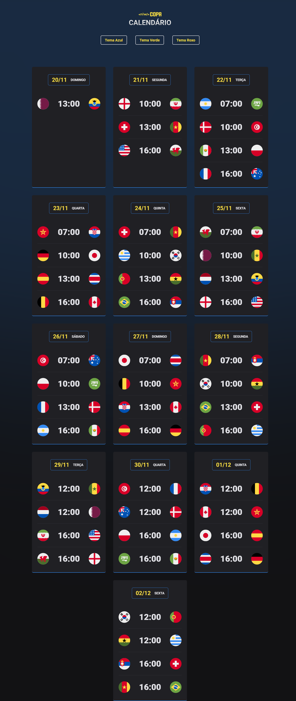

<h1 align="center"> Projeto NLW Copa 2022 ⚽️</h1>

Aulas gratuitas disponibilizadas pela Rocktseat para desenvolver habilidades frontend.

 

## 🚀 Tópicos Abordados

Através desse projeto desenvolvi habilidades em:

- HTML e CSS
- JavaScript
- Git e GitHub

## 💻 Projeto

Projeto desenvolvido para recriar os cards com horários e jogos da copa do Mundo de 2022.

ACESSE O PROJETO AQUI: https://mayaraabruceze.github.io/NLW-Copa2022/
